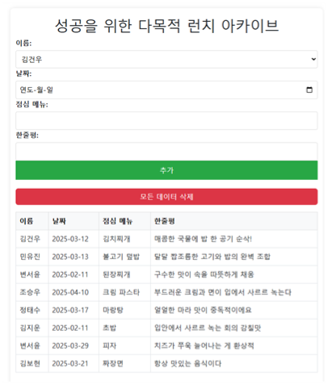
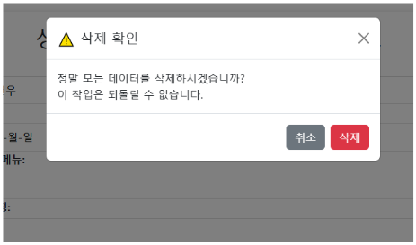
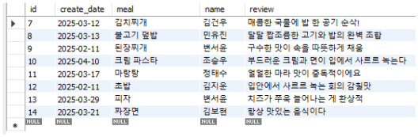

# 🔍 lunch_archive

**lunch_archive**은 친구들과의 웹 사이트 입니다.

## 🖥️ 프로젝트 개요

- 🧩 **개발 환경**: ECLIPSE
- 🛠️ **구현 방식**: Spring Boot 기반 웹 개발
- 🗃️ **데이터베이스**: MySQL
- 🎯 **주요 기능**:
  - 이름, 날짜, 메뉴, 한줄평 등록 기능

---

## ⚙️ 기술 스택

| 구성 요소      | 사용 기술                |
|----------------|--------------------------|
| 백엔드         | Java, MySQL               |
| 프론트엔드     | HTML, CSS, JavaScript    |
| 서버           | Spring Boot 내장 서버     |
| 데이터베이스    | MySQL                    |

---

## 🚩 실행 시 꼭 읽어주세요!
1. **MySql 데이터베이스 설정**
- 스키마, 테이블을 미리 생성해주셔야 합니다.
- 스키마 이름: lunch_archive
- 테이블 이름은 이미지를 확인해 주세요

4. **사이트 접속**
- launch.html에 접속합니다. 오타로 인해 a넣어주셔야 합니다.

--

## 🌄 화면 미리보기

lunch_archive의 주요 화면들을 아래에서 확인하실 수 있습니다.

<table>
  <tr>
    <td align="center"><b>🏠 메인 페이지</b></td>
    <td align="center"><b>📄 삭제확인모달</b></td>
  </tr>
  <tr>
    <td></td>
    <td></td>
  </tr>
  <tr>
    <td align="center"><b>📄 DB</b></td>
  </tr>
  <tr>
    <td></td>
  </tr>
</table>

---

## 📌 향후 개선 방향

- DB 스키마 및 테이블 자동 생성 스크립트 개발
- 그룹끼리 공유 가능하도록 개발
- 회원가입 및 로그인

---

## 📮 문의
- 백엔드, 프론트 개발자: **김보현**  
- 이메일: `qhgus9346@gmail.com`
